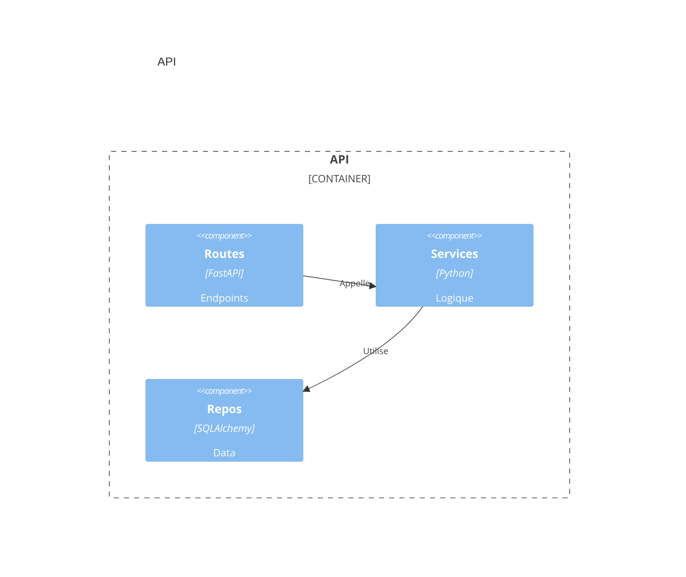

# C4 - Components

Modules internes de l'API.

```mermaid
C4Component
    title API

    Container_Boundary(api, "API") {
        Component(routes, "Routes", "FastAPI", "Endpoints")
        Component(services, "Services", "Python", "Logique")
        Component(repos, "Repos", "SQLAlchemy", "Data")
    }

    Rel(routes, services, "Appelle")
    Rel(services, repos, "Utilise")
```
