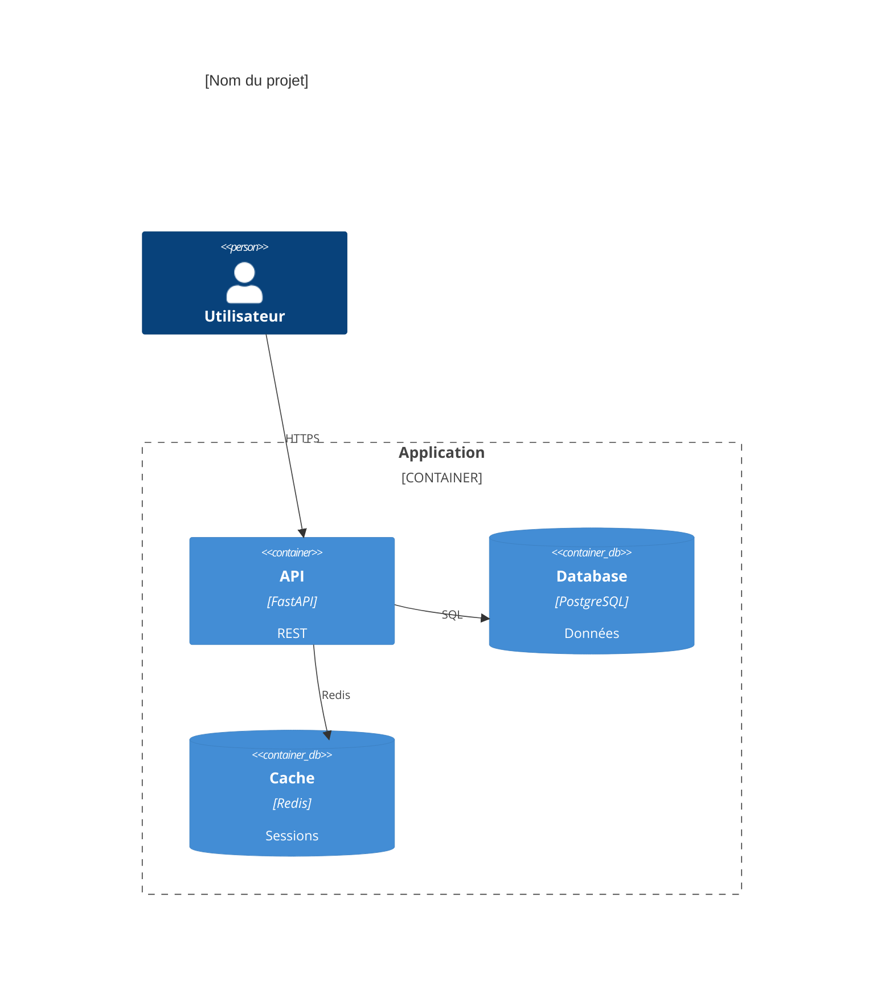

# C4 - Containers

Services qui composent le système.

```mermaid
C4Container
    title [Nom du projet]

    Person(user, "Utilisateur")

    Container_Boundary(app, "Application") {
        Container(api, "API", "FastAPI", "REST")
        ContainerDb(db, "Database", "PostgreSQL", "Données")
        ContainerDb(cache, "Cache", "Redis", "Sessions")
    }

    Rel(user, api, "HTTPS")
    Rel(api, db, "SQL")
    Rel(api, cache, "Redis")
```
