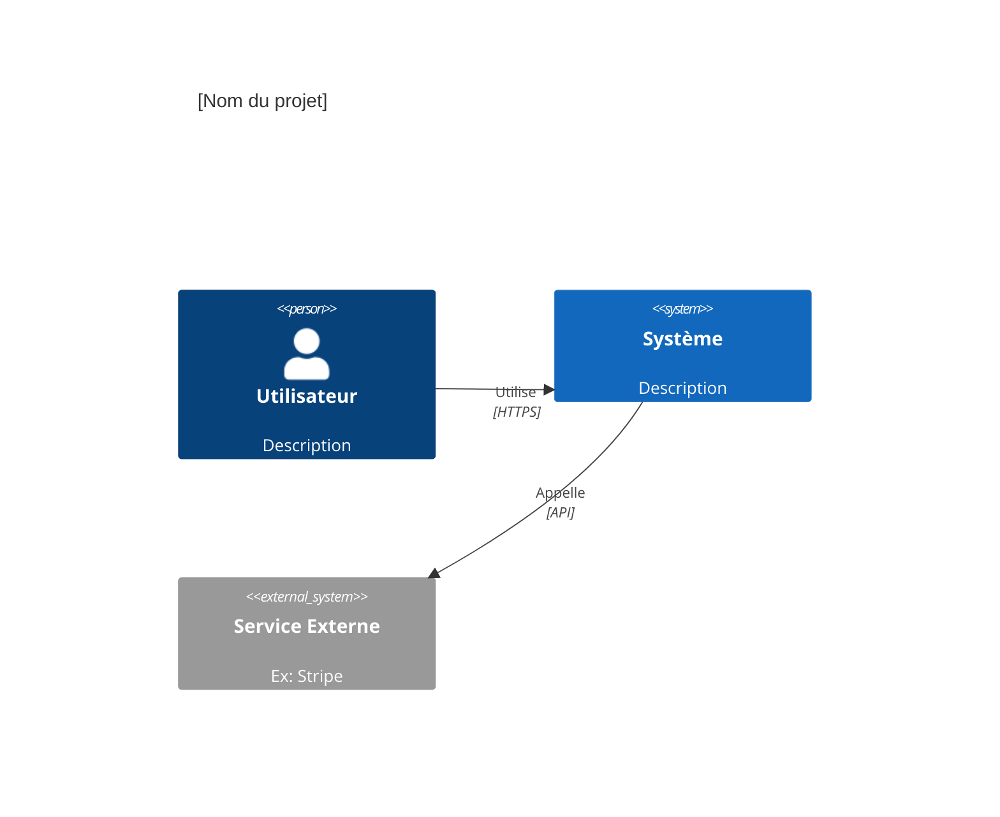

# C4 - Contexte

Qui utilise le système et ses interactions externes.

```mermaid
C4Context
    title [Nom du projet]

    Person(user, "Utilisateur", "Description")
    System(app, "Système", "Description")
    System_Ext(ext, "Service Externe", "Ex: Stripe")

    Rel(user, app, "Utilise", "HTTPS")
    Rel(app, ext, "Appelle", "API")
```
